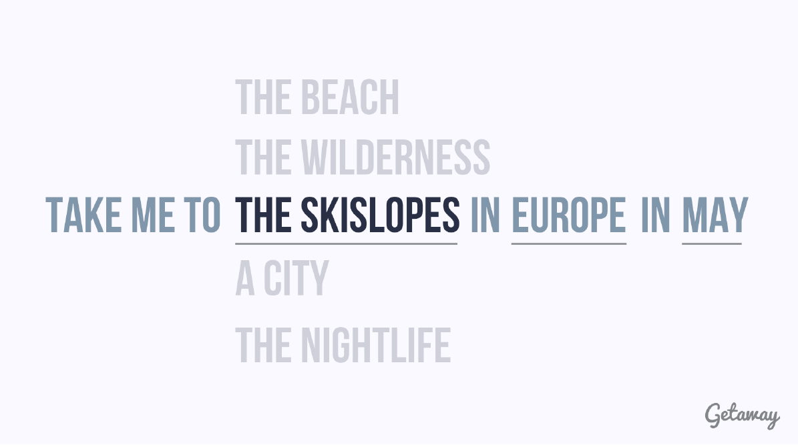
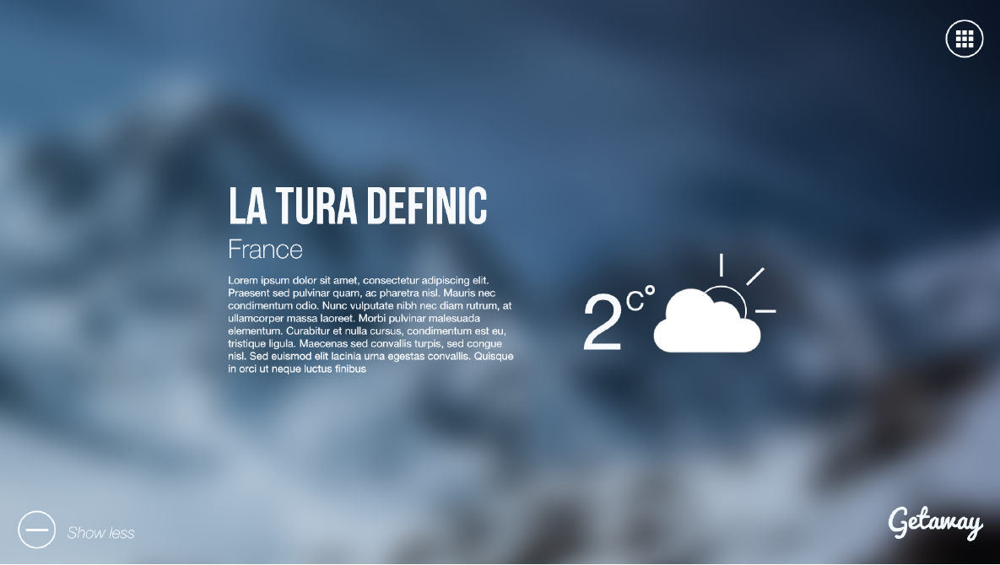
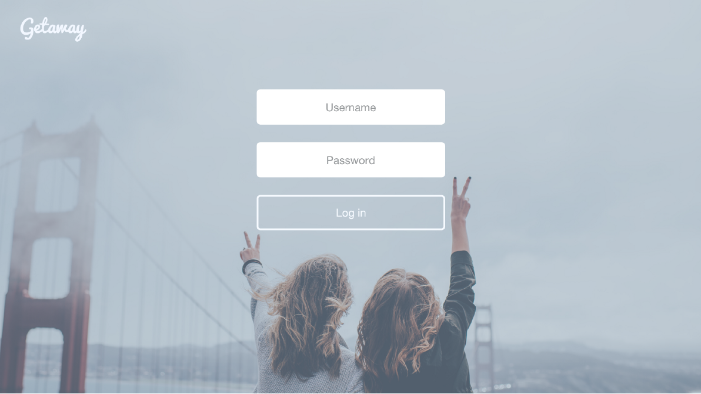
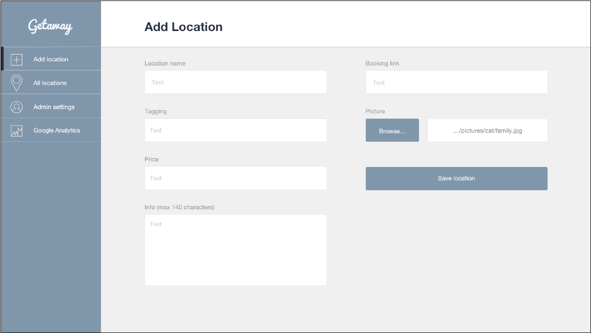

# GetAway

This was a project created by five people in the first year of university. The goal of the project was to create a website which helps users to new exciting travel destinations. The webpage is going to randomize suggestion of destinations based on a number of criteria which the user have selected.  

## Screenshots

*When the user enters the webpage, the user lands on this page where the user can select his or hers criteria*

*The user gets one results on a destination*

*The user can read more about the destination*

*Login page for admin*

*Dashboard where the admin can submit new destination recommendations, change password etc*

